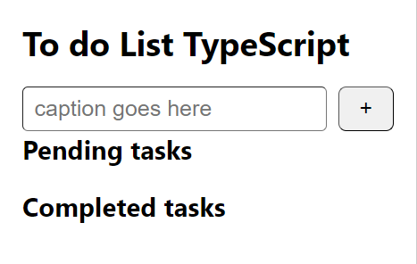
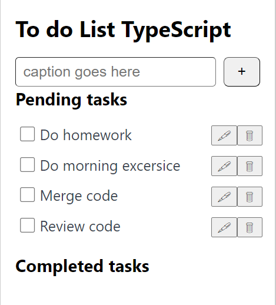
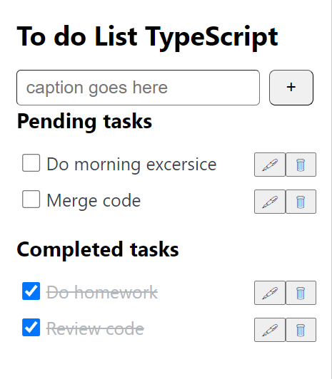
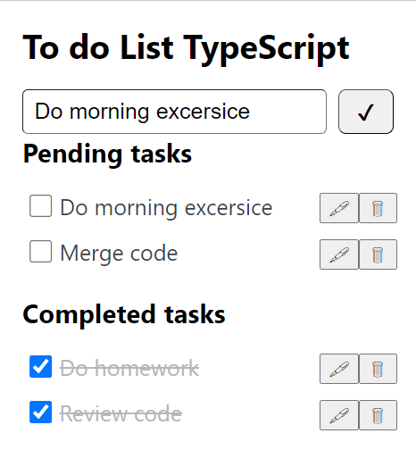

# TodoList App

This is a simple project to manage your tasks.

_This readme contains installations and usages for TodoList App_

This project was bootstrapped with [Create React App](https://github.com/facebook/create-react-app).

## Installation and Usage

### Installation

To ensure the project runs, please install [yarn](https://classic.yarnpkg.com/lang/en/docs/install/)

After cloning project, you need to install the project dependencies

```bash
yarn install
```

Run application

```bash
yarn start
```

Runs the app in the development mode.
Open [http://localhost:3000](http://localhost:3000) to view it in the browser.

Application interface

<p align="center" >

</p>

### Usages

The application is simple to use, you can add tasks, delete tasks, edit tasks. It can save tasks when you exit the application.

Add tasks

<p align="center">

</p>

Completed tasks

<p align="center">

</p>

Edit tasks

<p align="center">

</p>

The app can remember what you've done, so when you exit and re-enter the app, your work will still be fully displayed.
